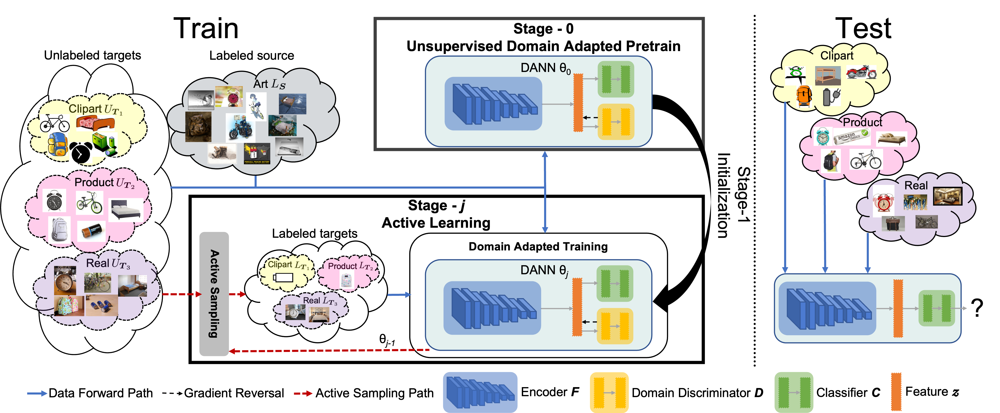

# D<sup>3</sup>GU: Multi-target Active Domain Adaptation via Enhancing Domain Alignment (WACV 2024)
<hr/>
<a href="https://arxiv.org/abs/2401.05465"></a>
<a href="https://opensource.org/licenses/MIT"></a>  

## Overview
<hr/>


We propose a Multi-Target Active
Domain Adaptation (MT-ADA) framework for image classification, named D<sup>3</sup>GU. 
It is designed to align source and multiple target domains via
* Decomposed Domain Discrimination (D<sup>3</sup>) during training to achieve both source-target and target-target domain alignments.
* GU-KMeans during active selection to sample informative images for annotation.

## Installation
<hr/>

Install conda or miniconda then create new environment with the provided ``d3gu.yml`` file:
```angular2html
conda env create -f d3gu.yml
```

## Dataset Preparation
<hr/>

We use 
[Office31](https://faculty.cc.gatech.edu/~judy/domainadapt/#datasets_code:~:text=Office-,Dataset,-%3A%20Images%20/), 
[OfficeHome](https://www.hemanthdv.org/officeHomeDataset.html), 
and [DomainNet](https://ai.bu.edu/M3SDA/#dataset) 
in experiments. Please create a ``datasets`` folder and download the images under it. 
The structure of ``datasets`` directory should be:

```angular2html
|-- datasets
|   |-- office31
|   |   |-- amazon
|   |   |-- dslr
|   |   |-- webcam
|   |-- office-home
|   |   |-- art
|   |   |-- clipart
|   |   |-- product
|   |   |-- real
|   |-- domain-net
|   |   |-- clipart
|   |   |-- infograph
|   |   |-- painting
|   |   |-- quickdraw
|   |   |-- real
|   |   |-- sketch
```

## Training and Evaluation
<hr/>

Training is composed of two stages: unsupervised pretraining stage and active learning stage.
Evaluation is automatically applied after training.
In parallel, there are 3 domain discrimination methods {disc}: 
* binary domain discrimination (bin)
* all-way domain discrimination (aw)
* docomposed domain discrimination (d3)

### Unsupervised pretraining
Select discrimination method {disc}, dataset {dataset}, and find corresponding config file under ``config/pretrain_dann_{disc}/{dataset}``. Then train on a single gpu with command:
```angular2html
python pretrain_dann_{disc}.py --config_file config/pretrain_dann_{disc}/{dataset}/xxx.yaml
```

### Active training
Select discrimination method {disc}, dataset {dataset}, and active selectino algorithm {alg}. Find corresponding config file under ``config/active_dann_{disc}/{dataset}/target_combined/{alg}/xxx.yaml`` and train on a single gpu with command:
```angular2html
python active_dann_{disc}.py --config_file config/active_dann_{disc}/{dataset}/target_combined/alg/xxx.yaml
```

## Pretrained checkpoints
<hr/>

We provide unsupervised pretrained checkpoints and actively trained checkpoints here:

**binary domain discrimination**

|        Method         |                 Dataset                 |                                                                                                                                                        Link                                                                                                                                                        |
|:---------------------:|:---------------------------------------:|:------------------------------------------------------------------------------------------------------------------------------------------------------------------------------------------------------------------------------------------------------------------------------------------------------------------:|
| Unsupervised Pretrain | Office31 <br> OfficeHome <br> DomainNet | [Google Drive](https://drive.google.com/file/d/1vt95vaoLVGZK0zzcABW98l23SfInDG9Q/view?usp=sharing) <br> [Google Drive](https://drive.google.com/file/d/1nwmZ6gqTQQvv-wP4sCNY7Y4RhSxFauSc/view?usp=sharing) <br> [Google Drive](https://drive.google.com/file/d/1ivhzmZqck_hIlZ-Q0vUr7xWI63l1Naz2/view?usp=sharing) |
|       GU-KMeans       | Office31 <br> OfficeHome <br> DomainNet | [Google Drive](https://drive.google.com/file/d/1d9ih5kjefySUWtJtiEcWynHi5PY3SMrc/view?usp=sharing) <br> [Google Drive](https://drive.google.com/file/d/1lNK7zugpxiH2DMG_45ACQvV8435Tqfaw/view?usp=sharing) <br> [Google Drive](https://drive.google.com/file/d/1p-n6O_DgGUANIKKCaUUrBBsQ9nwePeuy/view?usp=sharing) |

**all-way domain discrimination**

|        Method         |                 Dataset                 |                                                                                                                                                        Link                                                                                                                                                        |
|:---------------------:|:---------------------------------------:|:------------------------------------------------------------------------------------------------------------------------------------------------------------------------------------------------------------------------------------------------------------------------------------------------------------------:|
|Unsupervised Pretrain  | Office31 <br> OfficeHome <br> DomainNet | [Google Drive](https://drive.google.com/file/d/1dnVrD3APFpTx7WsTaO8l_8wsvurB0r-Q/view?usp=sharing) <br> [Google Drive](https://drive.google.com/file/d/10GRQJU4L0_u85pmbXL9He7G38CPL5OBr/view?usp=sharing) <br> [Google Drive](https://drive.google.com/file/d/10zdiIVpybXUjfxxZHxmFYDrNqeIvbcSY/view?usp=sharing) |
|       GU-KMeans       | Office31 <br> OfficeHome <br> DomainNet | [Google Drive](https://drive.google.com/file/d/1g5MfdITnEoPrLXrQd2A0uAEKzYI-PH20/view?usp=sharing) <br> [Google Drive](https://drive.google.com/file/d/14iH6h-r6DX5SveLFnEMOi9PAhPDIskXp/view?usp=sharing) <br> [Google Drive](https://drive.google.com/file/d/1o3WFiBumD4VeTgot5opWJV2BzenMRHgF/view?usp=sharing) |

**decomposed domain discrimination**

|        Method         |                 Dataset                 |                                                                                                                                                        Link                                                                                                                                                        |
|:---------------------:|:---------------------------------------:|:------------------------------------------------------------------------------------------------------------------------------------------------------------------------------------------------------------------------------------------------------------------------------------------------------------------:|
| Unsupervised Pretrain | Office31 <br> OfficeHome <br> DomainNet | [Google Drive](https://drive.google.com/file/d/1OV6QqgStd5-2rDXXPT-hUB63YUJi2trq/view?usp=sharing) <br> [Google Drive](https://drive.google.com/file/d/1Xq2O21acIxN1N24mVhjd1xmOLqOXT17V/view?usp=sharing) <br> [Google Drive](https://drive.google.com/file/d/1a3iai1LD9pTWi9Aj4reF6qBxDvr2yhC9/view?usp=sharing) |
|       GU-KMeans       | Office31 <br> OfficeHome <br> DomainNet | [Google Drive](https://drive.google.com/file/d/1OjhFpS2NMvI0K3KIYp9zwtpBEku_yEAf/view?usp=sharing) <br> [Google Drive](https://drive.google.com/file/d/1I8z1UZxTH80AvSnUvRHB90_8DQnCm3uR/view?usp=sharing) <br> [Google Drive](https://drive.google.com/file/d/1wJ7yBC-ldfpgYNjdool8gk8NuxvdNNse/view?usp=sharing) |


## Citation
<hr/>

If you find this repo useful, please cite:
```
@inproceedings{zhang2024d3gu,
  title={D3GU: Multi-target Active Domain Adaptation via Enhancing Domain Alignment},
  author={Zhang, Lin and Xu, Linghan and Motamed, Saman and Chakraborty, Shayok and De la Torre, Fernando},
  booktitle = {WACV},
  year={2024}
}
```


